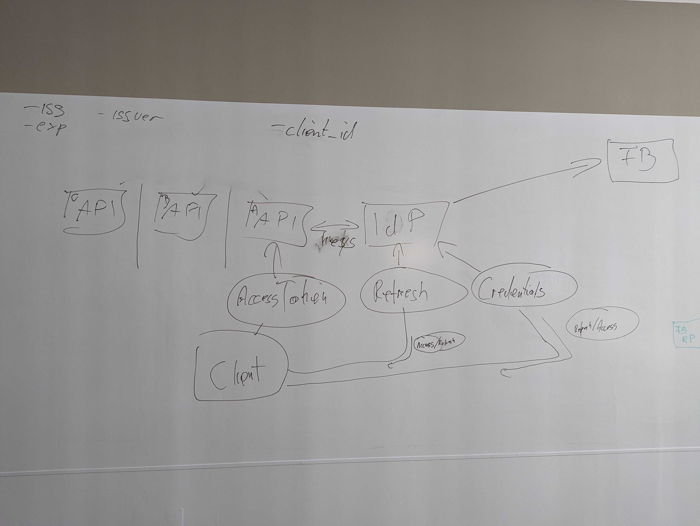

# Q&A / AMA SSO

**Session by Jan**

Why do I need this?

Regular web app: Session IDs are not scalable.

Flow:

1. Client wants talk to API
2. Client has to ask IdP whether they may do that
3. Client needs to provide some credentials to make sure, client IS the person they say they are.
4. IdP gives client two tokens: Refresh token and access token
5. Client can access that specific API with that specific access token
6. Whenever access tokens expire, client has to ask IdP for a new one with the refresh token.

Every API has their own access token.

## Glossar

- IdP = Identity Provider
- client_id: both API and client have one

- Authentication code flow: Backend can directly interact with FB after getting the token/code.

## Whiteboard pictures

